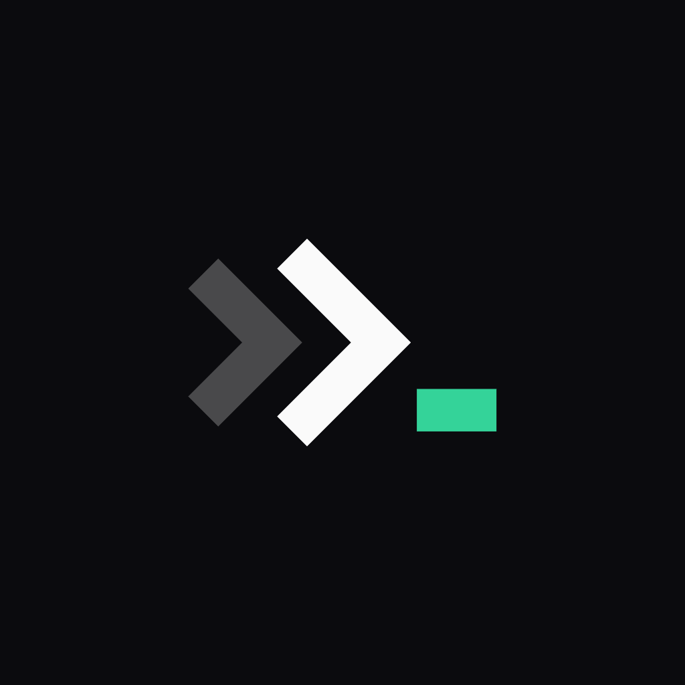
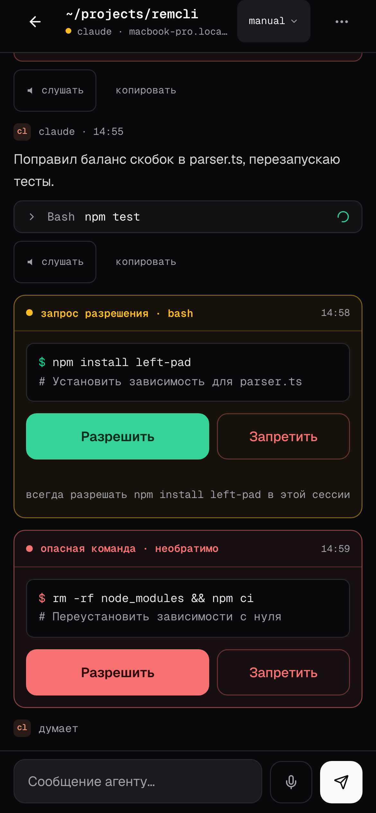

<p align="center">
  
</p>

<h1 align="center">Remcli</h1>

<p align="center"><strong>Телефон — в руке, код — дома.</strong></p>

<p align="center">Запустите Codex на своём Mac или Linux и продолжайте работу с телефона.</p>

<p align="center">
  
</p>

## Ваш компьютер остаётся главным

- **Без облака Remcli.** Нет центрального сервера, облачной базы переписок или отдельного аккаунта Remcli.
- **Прямая связь в LAN.** Телефон подключается к daemon на вашем компьютере по QR-коду; сообщения и служебные данные шифруются.
- **Одна работа, два экрана.** Для Codex телефон и терминал используют одну нативную сессию: можно начать за компьютером и продолжить с телефона.
- **Доступ извне по вашему выбору.** Когда LAN недостаточно, включите cloudflared tunnel. Remcli по-прежнему не хранит переписку у себя.

## Подключение по QR

Запустите daemon, отсканируйте QR-код и подключите телефон к конкретному компьютеру. Отдельный аккаунт Remcli не нужен.

<p align="center">
  
</p>

## Сессии всегда под рукой

Видно, что запущено, что ждёт разрешения и где вы остановились. Сессии можно открыть, остановить и возобновить без поиска нужного терминала.

<p align="center">
  
</p>

## Провайдеры

| Провайдер | Статус | Сейчас |
| --- | :---: | --- |
| Codex CLI | ✅ | Создание, остановка, resume, общий native thread, модели, reasoning и уровни доступа |
| Cursor CLI | ✅ | Создание и native resume; история и отдельные native controls продолжают развиваться |
| Claude Code | ❌ | Нужна отдельная provider-specific приёмка |
| Gemini CLI | ❌ | Нужна отдельная provider-specific приёмка |

Статус описывает готовность интеграции Remcli, а не подписку у провайдера.

## Быстрый старт

Нужны Node.js 20+, `tmux` и установленный, авторизованный Codex CLI. Для голосовых функций понадобится `ffmpeg`.

```bash
# macOS
brew install tmux

# Debian / Ubuntu
sudo apt install tmux
```

```bash
git clone https://github.com/spetrosyan94/remcli.git
cd remcli
npm run setup
npm start
```

`npm run setup` — установщик Remcli: он поставит npm-зависимости, соберёт проект и откроет интерактивный мастер настройки. После `npm start` отсканируйте QR-код и создайте Codex-сессию.

<p align="center">
  
</p>

Для доступа вне LAN и голосового ввода с телефона запускайте `npm run start:tunnel`: браузер требует HTTPS для микрофона.

| Команда | Что делает |
| --- | --- |
| `npm run setup` | Установщик и интерактивный мастер настройки |
| `npm start` | Собирает проект и запускает daemon в LAN |
| `npm run start:tunnel` | Запускает daemon с cloudflared tunnel |
| `npm run codex` | Открывает Codex-сессию из терминала |
| `npm run status` | Показывает статус daemon |
| `npm run qr` | Показывает QR-код повторно |
| `npm run doctor` | Проверяет окружение |
| `npm run stop` | Останавливает daemon |

## Чат, а не урезанный пульт

В чате видны ответы агента, tool calls, статус работы и запросы разрешений. Модели, уровень размышления и доступ выбираются из возможностей подключённого provider, а не из вручную придуманных списков.

<p align="center">
  
</p>

## Дополнительные возможности

| Возможность | Для чего нужна |
| --- | --- |
| Джарвис | Локальный помощник через LM Studio или другой OpenAI-compatible endpoint |
| Whisper | Голосовой ввод в чат на локальной модели |
| Edge TTS | Озвучивание ответов без локальной большой модели |
| Qwen3 TTS | Локальная озвучка и voice profiles на Apple Silicon |

Джарвис выключен по умолчанию: запустите модель в LM Studio и включите `conciergeEnabled` с `conciergeUrl` в `~/.remcli/setup.json`.

<p align="center">
  
</p>

Все кадры — иллюстративные, сняты в fixture-режиме Remcli: mobile 390x844 @3x, desktop 1280x800 @2x.

## Что внутри

`Телефон или браузер` → `daemon на вашем Mac/Linux` → `CLI провайдера`.

Стек: TypeScript, React 19, Vite, Tailwind CSS, Radix UI, Zustand, Fastify, Socket.IO, Zod, Ink, ACP/MCP. Payloads между web-клиентом и daemon шифруются на уровне приложения.

## Roadmap

- Завершить provider-specific приёмку Claude Code и Gemini CLI.
- Довести Cursor capabilities, названия и сортировку resume-истории.
- Добавить lifecycle persistence daemon и безопасный cleanup процессов.
- Развить Zen: удаление задач; отдельно спроектировать live web terminal.

## Документация

- [Индекс документации](docs/index.md)
- [Протокол](docs/protocol.md)
- [Шифрование](docs/encryption.md)
- [CLI и daemon](docs/cli-architecture.md)
- [Архитектура Codex](docs/agent-architecture/codex-chatgpt-architecture.md)
- [Архитектура Cursor](docs/agent-architecture/cursor-cli-architecture.md)

## Лицензия

MIT
