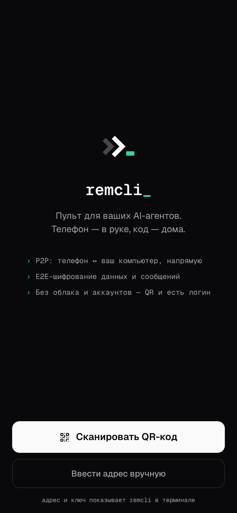
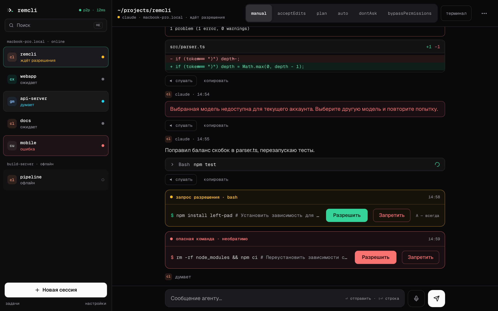
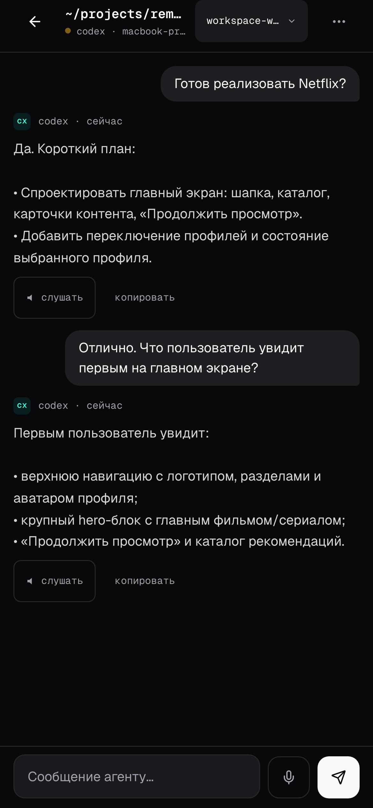
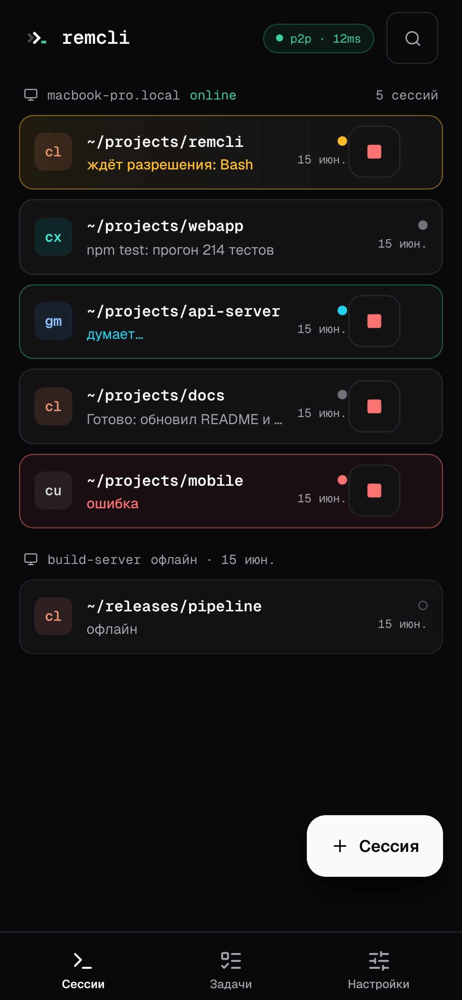
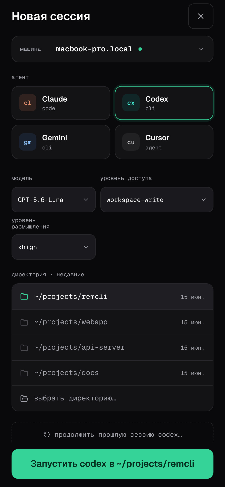
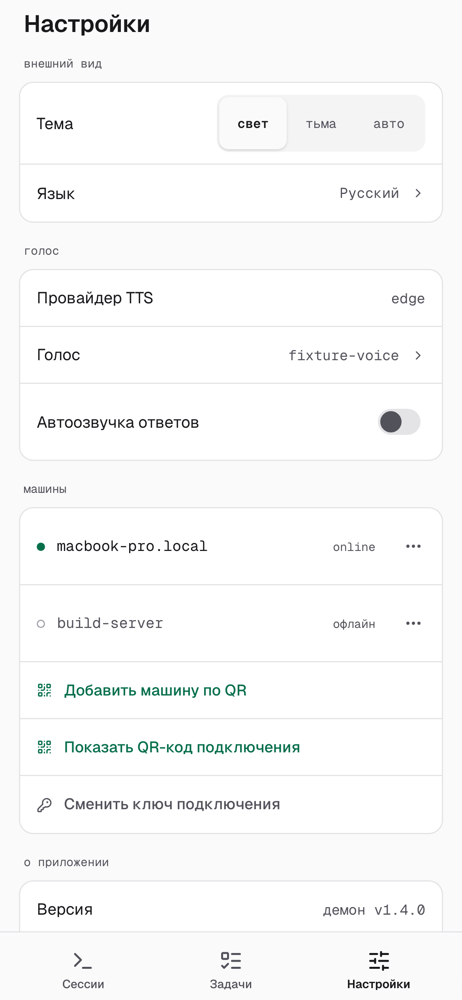

<p align="center">
  <picture>
    <source media="(prefers-color-scheme: dark)" srcset="images/remcli-logo-dark.svg" />
    
  </picture>
</p>

<h1 align="center">Remcli</h1>

<p align="center"><strong>Телефон — в руке, код — дома.</strong></p>

<p align="center">Remote CLI для AI coding-агентов: управляйте рабочими сессиями, терминалами и задачами с телефона или браузера.</p>

<p align="center">
  
</p>

## Один рабочий стол — на любом экране

Remcli даёт полноценный desktop-режим для работы за компьютером и компактный интерфейс для телефона. Запускайте несколько AI-сессий параллельно, сразу видьте их состояние и возвращайтесь к нужной работе без поиска терминала.

<p align="center">
  
</p>

- Создавайте сессии из нужной папки проекта.
- Выбирайте доступные модели, уровень размышления и права доступа агента.
- Открывайте, останавливайте и возобновляйте прошлые сессии.
- Начните работу за компьютером, продолжите с телефона и вернитесь к ней в терминале. Для Codex это одна нативная сессия на обоих экранах.

## Из дома, офиса и дороги

Основной сценарий для удалённой работы — `npm run start:tunnel`: при установленном `cloudflared` Remcli открывает HTTPS Cloudflare Tunnel, и вы управляете своим AI-агентом с телефона из любого места. Если tunnel недоступен, Remcli остаётся в локальном режиме; в одной Wi-Fi сети достаточно `npm start`.

## Никаких аккаунтов Remcli

Ни почты, ни пароля, ни отдельного сервиса с вашей перепиской. QR-код безопасно связывает телефон с вашим компьютером по личному секретному ключу. Проект и агент остаются на вашей машине, а содержимое сообщений и сессий шифруется.

<p align="center">
  
</p>

## Все рабочие сессии под рукой

На одном экране видно, кто работает, кто ждёт разрешения, где произошла ошибка и к какой задаче нужно вернуться. Управляйте несколькими параллельными сессиями, даже когда компьютера нет рядом.

<p align="center">
  
</p>

## Интеграции

| AI CLI | Готовность | Что уже можно |
| --- | :---: | --- |
| Codex CLI | ✅ | Полный рабочий цикл: новая сессия из папки проекта, общий чат телефона и терминала, tool calls, запросы разрешений, остановка и resume без потери контекста. |
| Cursor CLI | ✅ | Запуск и продолжение сессий, выбор моделей и режимов из возможностей установленного Cursor CLI. |
| Claude Code | ⏳ | В разработке: завершаем полный пользовательский сценарий от терминала до телефона. |
| Gemini CLI | ⏳ | В разработке: завершаем полный пользовательский сценарий от терминала до телефона. |

## Быстрый старт

Нужны Node.js 20+, установленный и авторизованный CLI выбранного AI-провайдера и `tmux` для управляемых сессий. Для удалённого режима нужен `cloudflared`. Remcli запускается на macOS и Linux; на Windows используйте WSL с `tmux`. `ffmpeg` нужен только для голосовых функций.

```bash
git clone https://github.com/spetrosyan94/remcli.git
cd remcli
npm run setup
npm run start:tunnel
```

`npm run setup` установит зависимости, соберёт проект и откроет мастер настройки. После запуска отсканируйте QR-код, выберите провайдера и папку проекта — сессия готова к работе.

<p align="center">
  
</p>

| Команда | Что делает |
| --- | --- |
| `npm run setup` | Устанавливает зависимости, собирает проект и открывает мастер настройки. |
| `npm run start:tunnel` | Основной удалённый режим: при установленном `cloudflared` запускает HTTPS Cloudflare Tunnel. |
| `npm start` | Локальный режим для одной Wi-Fi сети без tunnel. |
| `npm run status` | Показывает состояние daemon и запущенных процессов. |
| `npm run qr` | Показывает QR-код повторно. |
| `npm run doctor` | Проверяет окружение и установленные AI CLI. |
| `npm run stop` | Останавливает daemon. |

## Не просто чат — полный контроль агента

Пишите агенту, следите за ходом работы и вмешивайтесь в нужный момент. Remcli показывает не только ответы, но и реальную работу AI на вашем компьютере.

- Поток ответов, tool calls, ошибки и статус выполнения в одном чате.
- Запросы разрешений на команды и изменения: разрешайте или отклоняйте действие с телефона.
- Выбор модели, уровня размышления и доступа там, где это поддерживает AI CLI.
- Запуск из конкретной директории, resume прошлых сессий и управление несколькими активными задачами.

## Дополнительные возможности

| Возможность | Для чего нужна |
| --- | --- |
| Джарвис | Компактный локальный помощник для базовых операций: узнать, что запущено, получить статус или попросить открыть сессию. |
| Whisper | Голосовой ввод в чат на локальной модели. |
| Edge TTS | Озвучивание ответов без установки большой локальной модели. |
| Qwen3 TTS | Локальная озвучка и voice profiles на Apple Silicon. |

Джарвис выключен по умолчанию: запустите компактную модель в LM Studio и включите его в `~/.remcli/setup.json`.

<p align="center">
  
</p>

## Что внутри

`Телефон или браузер` → `локальный Remcli на вашем компьютере` → `CLI выбранного AI-провайдера`.

У Remcli нет своей облачной базы сессий: проект и агент остаются на вашем компьютере. В локальной сети телефон подключается напрямую; для удалённого доступа используется Cloudflare Tunnel. Содержимое сообщений и сессий шифруется между web-клиентом и Remcli на вашем компьютере.

Стек: TypeScript, React 19, Vite, Tailwind CSS, Radix UI, Zustand, Fastify, Socket.IO, Zod, Ink, ACP/MCP.

## Roadmap

- Завершить полный пользовательский сценарий Claude Code и Gemini CLI.
- Довести Cursor capabilities, названия и сортировку resume-истории.
- Добавить lifecycle persistence daemon и безопасный cleanup процессов.
- Развить Zen: удаление задач; отдельно спроектировать live web terminal.

## Документация

- [Индекс документации](docs/index.md)
- [Протокол](docs/protocol.md)
- [Шифрование](docs/encryption.md)
- [CLI и daemon](docs/cli-architecture.md)
- [Архитектура Codex](docs/agent-architecture/codex-chatgpt-architecture.md)
- [Архитектура Cursor](docs/agent-architecture/cursor-cli-architecture.md)

## Лицензия

MIT
