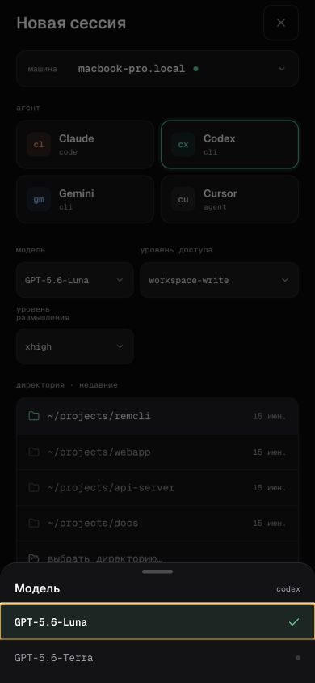
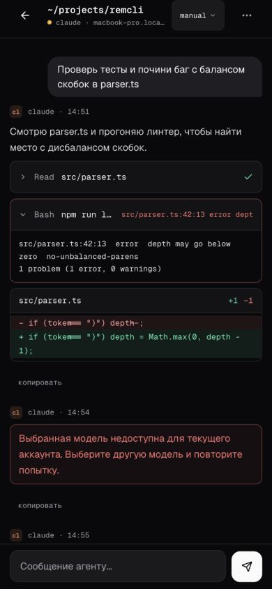
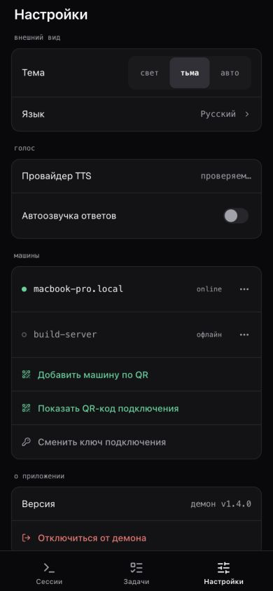
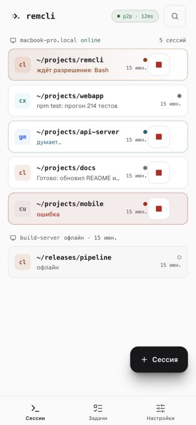

# Remcli

**P2P web/PWA-клиент для управления AI coding-agent сессиями с телефона или браузера.**

Запустите агент на Mac или Linux, отсканируйте QR-код и продолжайте работу из Remcli. У проекта нет собственного cloud backend: web-клиент подключается напрямую к локальному daemon по LAN или через опциональный cloudflared tunnel.

<p align="center">
  
</p>

## Что даёт Remcli

- Управление сессиями AI coding agents из PWA и терминала.
- Для Codex: одна нативная сессия в терминале и на телефоне, создание, остановка и resume без потери контекста.
- QR pairing, прямое LAN-подключение и опциональный доступ извне через tunnel.
- Выбор доступных моделей, уровней размышления и доступа из реальных данных provider там, где CLI их предоставляет.
- Шифрование содержимого сообщений между web-клиентом и daemon на уровне приложения.

## Архитектура

```text
Телефон / браузер  <── HTTP/WebSocket + шифрование payload ──>  Remcli daemon  <──>  provider CLI
                                   LAN / cloudflared
```

Daemon работает на вашей машине, раздаёт web-клиент и запускает provider CLI. QR-код используется для pairing; tunnel нужен для доступа вне локальной сети и для HTTPS-микрофона на телефоне.

**Стек:** TypeScript, React 19, Vite, Tailwind CSS, Radix UI, Zustand, Fastify, Socket.IO, Zod, Ink, ACP/MCP.

## Провайдеры

| Провайдер | Статус | Что доступно сейчас |
| --- | :---: | --- |
| Codex CLI | ✅ | Проверенный core lifecycle: create/resume, общий native thread и синхронизация сообщений, модели, reasoning и уровни доступа из provider capabilities |
| Cursor CLI | ✅ | Создание, native resume и account-visible models; история и отдельные native controls продолжают дорабатываться |
| Claude Code | ❌ | Runner есть, но provider-specific acceptance ещё не завершён |
| Gemini CLI | ❌ | ACP runner есть, но provider-specific acceptance ещё не завершён |

Статус отражает готовность интеграции Remcli, а не наличие аккаунта или подписки у провайдера.

## Опционально: голос и Джарвис

Whisper и TTS настраиваются через `npm run setup`. Для Джарвиса запустите модель в LM Studio и вручную включите `conciergeEnabled` с `conciergeUrl` в `~/.remcli/setup.json`.

| Возможность | Назначение | Требования |
| --- | --- | --- |
| Джарвис | Локальный помощник для статуса и запуска сессий через LM Studio или другой OpenAI-compatible endpoint | Модель в LM Studio, выключен по умолчанию |
| Whisper STT | Голосовой ввод в чат | Локальная Whisper-модель, `ffmpeg` и HTTPS tunnel для микрофона на телефоне |
| Edge TTS | Озвучивание ответов | `ffmpeg`; использует Edge TTS |
| Qwen3 TTS | Локальная озвучка и voice profiles | Apple Silicon и локальное окружение для модели |

## Установка и быстрый старт

**Нужно:** Node.js 20+, `tmux` и установленный/авторизованный Codex CLI. Для голосовых функций потребуется `ffmpeg`.

```bash
# macOS
brew install tmux

# Debian / Ubuntu
sudo apt install tmux
```

```bash
git clone https://github.com/spetrosyan94/remcli.git
cd remcli
npm run setup
npm start
```

После запуска отсканируйте QR-код телефоном в той же сети и создайте **Codex**-сессию из Remcli.

Для голосового ввода с телефона запускайте `npm run start:tunnel`: браузер не даёт доступ к микрофону на обычном HTTP LAN-адресе.

| Команда | Назначение |
| --- | --- |
| `npm run setup` | Установить зависимости, собрать проект и пройти мастер настройки |
| `npm start` | Собрать проект и запустить daemon в LAN |
| `npm run start:tunnel` | Запустить daemon с cloudflared tunnel |
| `npm run codex` | Запустить Codex-сессию из терминала |
| `npm run status` | Показать статус daemon |
| `npm run qr` | Показать QR-код повторно |
| `npm run doctor` | Проверить окружение |
| `npm run stop` | Остановить daemon |
| `npm run dev:web` | Запустить Vite dev server для web-клиента |

## Интерфейс

<p align="center">
  
  
  
  
</p>

Все screenshots сняты с работающего fixture-режима Remcli: мобильные — `390×844`, desktop — `1280×800`.

## Roadmap

- Завершить provider-specific acceptance для Claude Code и Gemini CLI.
- Довести Cursor capabilities, названия и сортировку resume-истории.
- Добавить lifecycle persistence daemon и безопасный cleanup процессов.
- Развить Zen: удаление задач; отдельно спроектировать live web terminal.

## Документация

- [Индекс документации](docs/index.md)
- [Протокол](docs/protocol.md)
- [Шифрование](docs/encryption.md)
- [CLI и daemon](docs/cli-architecture.md)
- [Архитектура Codex](docs/agent-architecture/codex-chatgpt-architecture.md)
- [Архитектура Cursor](docs/agent-architecture/cursor-cli-architecture.md)

## Лицензия

MIT
