# Архитектура CLI

Этот документ описывает Remcli (`packages/remcli-cli`) и его демон. CLI — это одновременно интерактивный инструмент и фоновый менеджер сессий, который синхронизирует состояние машины с сервером.

## Обзор системы

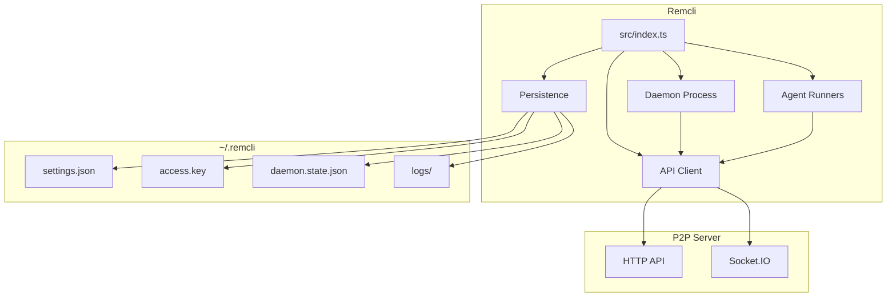

## Общая структура
- **Точка входа:** `src/index.ts` разбирает подкоманды и маршрутизирует выполнение.
- **API-клиент:** `src/api` отвечает за HTTP + Socket.IO, шифрование и RPC.
- **Демон:** `src/daemon` работает в фоне, запускает сессии и поддерживает состояние машины.
- **Персистентность/конфигурация:** `src/persistence.ts` + `src/configuration.ts` управляют локальным состоянием в `~/.remcli`.
- **Агенты:** `src/claude`, `src/cursor`, `src/codex`, `src/gemini` — раннеры для конкретных провайдеров.

## Поток запуска CLI

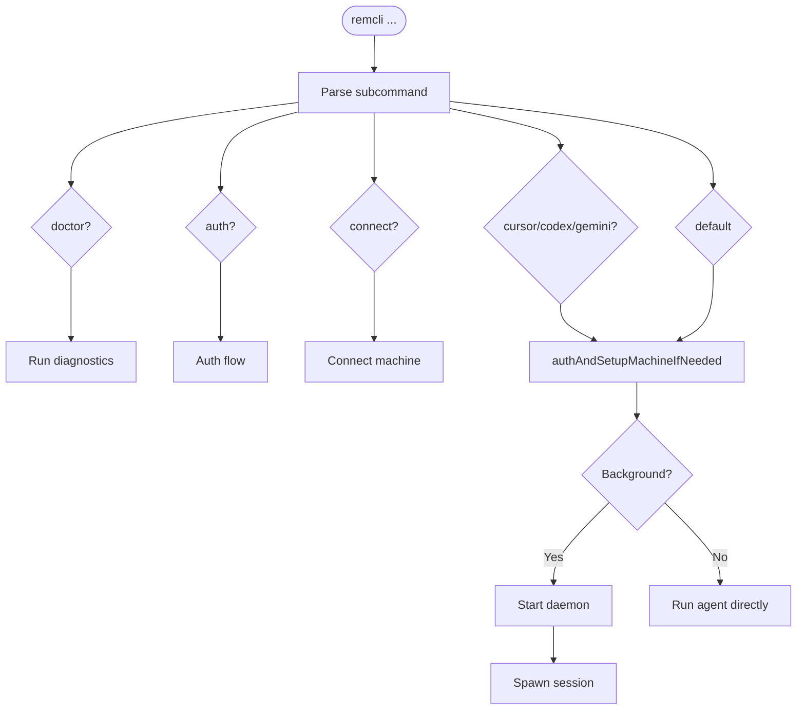

`src/index.ts` — роутер CLI. Он:
- Разбирает подкоманды (`doctor`, `setup`, `auth`, `connect`, `cursor`, `codex`, `gemini` и сценарии запуска по умолчанию).
- При необходимости обеспечивает аутентификацию и настройку машины (`authAndSetupMachineIfNeeded`).
- Запускает демон или агент напрямую в зависимости от подкоманды/контекста.

## Локальное состояние и конфигурация

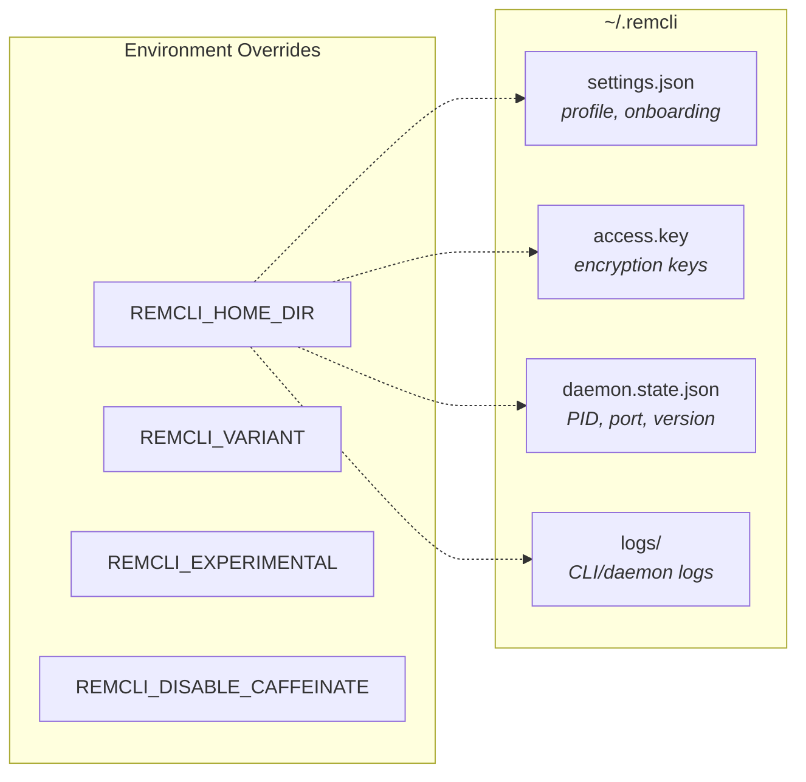

Локальное состояние хранится в `~/.remcli` (или `REMCLI_HOME_DIR`):
- `settings.json`: настройки онбординга и профиля (валидируются/мигрируются).
- `access.key`: локальный ключевой материал для шифрования/аутентификации.
- `daemon.state.json`: PID демона + контрольный порт + версия.
- `logs/`: логи CLI/демона.

Конфигурация находится в `src/configuration.ts`:
- Поведение управляется переменными `REMCLI_VARIANT`, `REMCLI_EXPERIMENTAL`, `REMCLI_DISABLE_CAFFEINATE`.

## Архитектура API-клиента

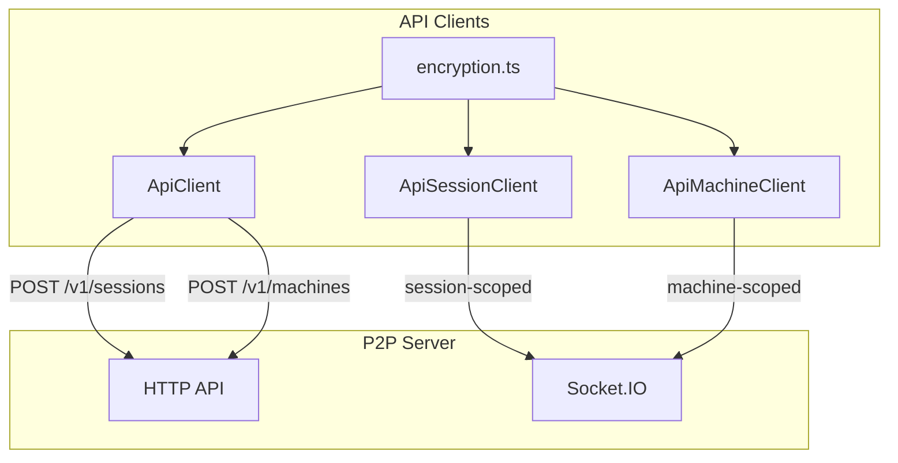

### HTTP
`ApiClient` (`src/api/api.ts`) отвечает за:
- Создание сессий (`POST /v1/sessions`) с зашифрованными метаданными/состоянием.
- Регистрацию машины (`POST /v1/machines`) с зашифрованными метаданными/состоянием демона.
- Остальные CRUD-операции через `ApiSessionClient` и `ApiMachineClient`.

### WebSocket

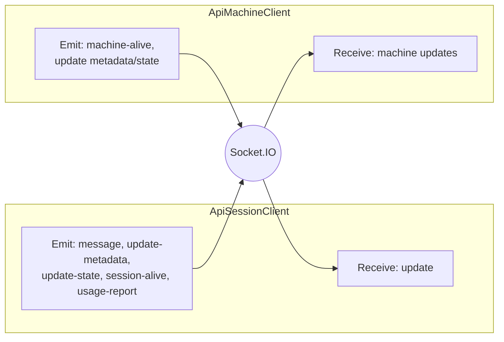

`ApiSessionClient` (`src/api/apiSession.ts`) подключается к Socket.IO как **session-scoped** клиент:
- Принимает события `update` и расшифровывает содержимое сообщений.
- Отправляет `message`, `update-metadata`, `update-state`, `session-alive` и `usage-report`.
- Выбирает схему live user prompt один раз из initial `metadata.flavor` daemon-owned
  runner-а. Позднее изменение metadata не способно сменить schema: Codex и
  Cursor принимают только текст с безопасной меткой источника, Claude/Gemini —
  только свои legacy native поля. Для старой transport-сессии без известного
  provider допустим лишь такой же безопасный text prompt; model, permissions,
  system prompt и tool controls отклоняются до runner callback.
- Typed `metadata.executionOutcome` синхронизируется через `update-metadata` как
  watermark `{ kind, occurredAt }`; error text, stack и provider payload туда не
  входят. Правила записи и UI-приоритеты: [протокол](protocol.md).

`ApiMachineClient` (`src/api/apiMachine.ts`) подключается как **machine-scoped** клиент:
- Шлёт heartbeat-события `machine-alive`.
- Обновляет метаданные машины/состояние демона с оптимистичным контролем конкурентности.
- Принимает обновления машины и сливает их локально.

### Шифрование

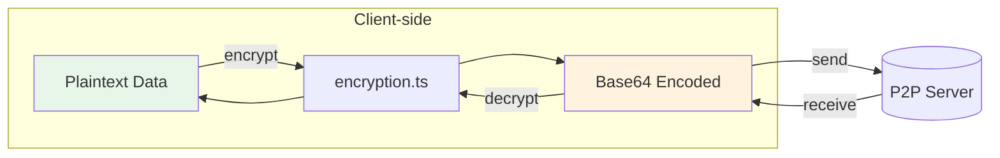

CLI шифрует клиентский контент до того, как он покидает машину, через `src/api/encryption.ts`.
- Метаданные сессии, состояние агента, сообщения, состояние машины и значения KV шифруются на стороне клиента.
- Кодирование на проводе — base64; см. `encryption.md`.

## Архитектура демона

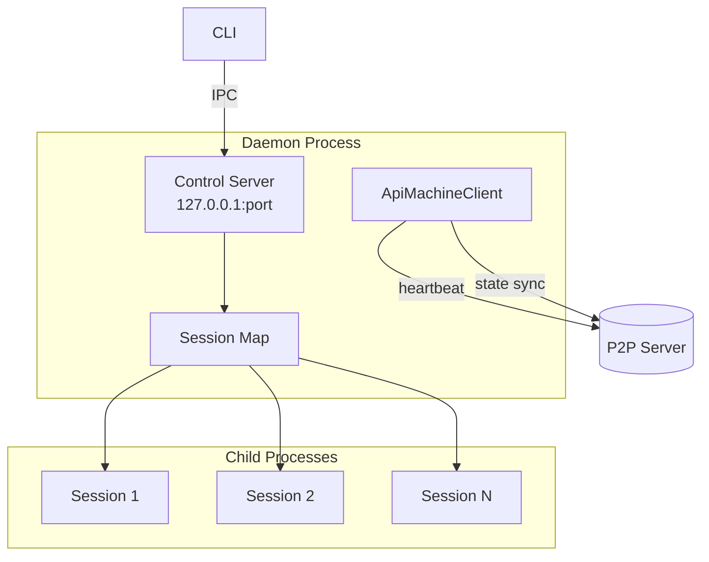

Демон — долгоживущий процесс, отвечающий за выполнение сессий в фоне и поддержание присутствия машины.

### Структура модулей

`src/daemon/run.ts` — тонкий координатор, связывающий сфокусированные модули:

| Модуль | Ответственность |
|--------|-----------------|
| `run.ts` | Оркестрация запуска/остановки: lock-файл, P2P-сервер, QR-код, туннель, связывание модулей ниже |
| `sessionSpawner.ts` | Фабрика менеджера сессий: запуск/остановка/трекинг дочерних сессий, окна tmux, очистка |
| `providerSpawnRequest.ts` | Строгая provider-discriminated граница encrypted machine-RPC перед capability validation и process spawn |
| `src/daemon/sessions/listAgentSessions.ts` | Сканирует on-disk хранилища сессий агентов (Claude/Codex/Cursor/Gemini) для пикера resume (RPC `list-agent-sessions`) |
| `machineSocket.ts` | Machine-scoped Socket.IO-клиент, подключающийся к собственному P2P-серверу демона; регистрирует RPC-обработчики (`spawn-session` и др.) |
| `heartbeat.ts` | Интервальный цикл: удаляет мёртвые сессии, автообновляется при смене версии CLI (запускает свежий демон, завершает себя), обнаруживает чужие демоны, пишет heartbeat в файл состояния |
| `controlServer.ts` | Локальный HTTP IPC только на `127.0.0.1` |

### Жизненный цикл

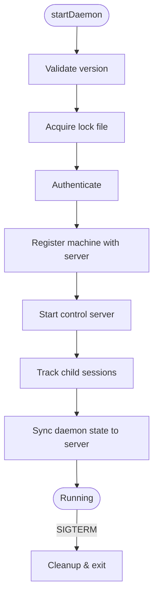

1. `startDaemon()` проверяет запущенную версию и захватывает lock-файл.
2. Аутентифицируется и регистрирует машину на сервере.
3. Запускает локальный **контрольный сервер** для IPC.
4. Ведёт map отслеживаемых дочерних сессий и обновляет состояние демона на сервере.

### Раздача веб-приложения

Демон раздаёт предсобранное веб-приложение (`packages/remcli-web/dist/` или bundled `web-dist/`) как статические файлы через `@fastify/static` на том же порту P2P-сервера. Это позволяет закодировать в QR-код URL, открывающий веб-приложение прямо с демона — отдельный dev-сервер не нужен. Демон ищет веб-сборку в:

1. Переменной окружения `REMCLI_WEB_DIR`
2. `../remcli-web/dist` относительно пакета `packages/remcli-cli`
3. `web-dist/` внутри опубликованного CLI-пакета
4. `packages/remcli-web/dist` относительно cwd

SPA-fallback роут отдаёт `index.html` на любой несматченный GET-запрос (кроме API-роутов `/v1/*` и `/v2/*`). Статические файлы раздаются без аутентификации; `bearer token` требуется только для API-роутов.

### Контрольный сервер (локальный IPC)

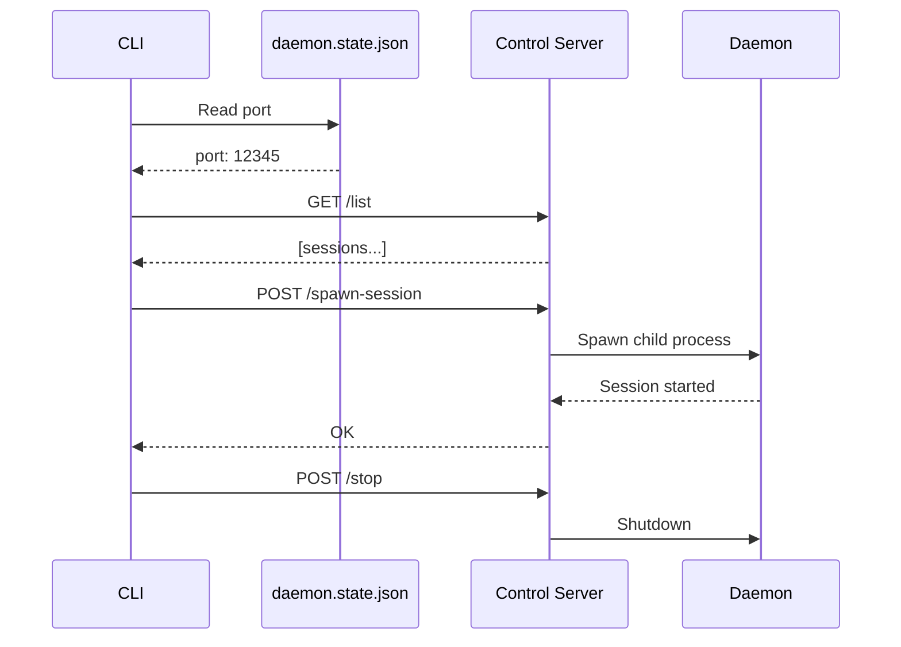

`startDaemonControlServer()` (`src/daemon/controlServer.ts`) запускает HTTP-сервер на `127.0.0.1` и предоставляет:
- `/list` (список активных сессий)
- `/stop-session`
- `/spawn-session`
- `/stop` (остановка демона)
- `/session-started` (самоотчёт сессии)
- `/pairing-rekey/approve` (только локальное подтверждение pending pairing rekey)

CLI общается с этим сервером через `controlClient.ts`, используя порт из `daemon.state.json`.

### Pairing QR и rekey

`p2pPairing.ts` хранит v2 pairing отдельно от daemon state: revocable `authSecret`, стабильный `contentSecret`, порт и дату. `PairingRekeyCoordinator` живёт только в памяти daemon и связывает browser request, TTL, host approval и sealed delivery. `machineSocket.ts` обслуживает `show-pairing-qr`, `request-pairing-rekey` и cancel pending request; подтверждение невозможно вызвать через P2P RPC и выполняется CLI-командой `remcli daemon rekey approve <request-id> <code>` через loopback control server. Перед commit coordinator повторно проверяет TTL/state, чтобы async QR generation не отозвала bearer после истечения ticket.

После успешной записи pairing файла `run.ts` переключает P2P auth secret, закрывает old user/machine sockets и заново подключает собственный machine socket. Content key и ACK runner credential не ротируются, поэтому активная Codex session не перезапускается. Полный wire contract — в [protocol.md](protocol.md) и [encryption.md](encryption.md).

### Запуск сессий

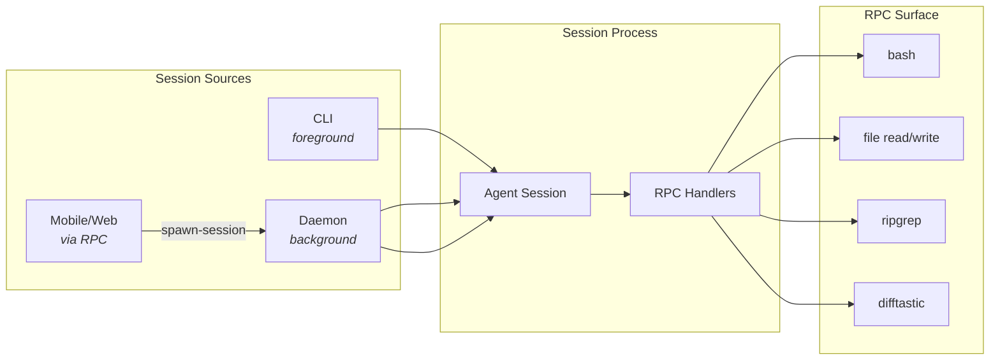

Сессии могут быть запущены:
- CLI напрямую (foreground).
- Демоном (в фоне).
- Удалёнными запросами по RPC (из mobile/web через подключение машины).

Каждая daemon-owned сессия получает собственный immutable tmux ownership tuple
(`sessionName`, window, pane, PID и owner marker). Display name tmux не
используется как идентификатор для destructive cleanup. На macOS daemon может
попросить Terminal.app открыть attach к owned pane: результат явно возвращается
как `opened`, `unavailable` или `not-requested`; невозможность открыть окно не
выдаётся за ошибку запуска agent runner.

При stop демон освобождает только подтверждённо owned child process/pane. При
`unknown` или `mismatch` tracking сохраняется для безопасной повторной попытки,
а не расширяется до пользовательского Terminal window или чужой tmux-сессии.

Внешний machine-RPC проходит `providerSpawnRequest.ts` до capability discovery:
общие lifecycle fields отделены от provider-native schemas. Поэтому Codex
получает только app-server selection, Cursor - только headless stream controls,
а daemon-issued runner identity никогда не приходит от web-клиента.

Запуск сессий демоном использует `registerCommonHandlers` для предоставления контролируемой RPC-поверхности (shell-команды, файловые операции, помощники поиска/diff).

### Возобновление сессий (resume)

Поддержка возобновления предыдущей сессии агента (например, по нажатию «Resume» в клиенте) различается по агентам:

| Агент | Resume | Механизм |
|-------|--------|----------|
| Claude Code | Реализован путь, acceptance pending | `--resume <id>`; история исходной сессии реплеится в P2P-хранилище (`src/claude/utils/replaySessionHistory.ts`). Отдельные provider-specific daemon-boundary, real CLI и Browser fixture gates ещё не приняты. |
| Cursor | Lifecycle D/I/L/UI-F принят; capability UX развивается | `agent --resume <id>` для подтверждённого native Cursor ID на каждый headless turn (`src/cursor/cursorQuery.ts`); активный daemon wrapper дедуплицируется по этому ID и workspace, а fresh daemon wrapper проходит capability-bound preflight до P2P creation. При `Ctrl+C` runner credential-подтверждённо блокирует повторный resume, отправляет финальный P2P lifecycle и только затем освобождает свой immutable tmux pane; повторный Stop отклоняется, а daemon shutdown ждёт completion ограниченное время и fail-closed при таймауте. Если runner уже умер до callback, reconcile допустим только после независимого immutable proof отсутствия его owned pane/session. Неподтверждённый ownership остаётся fail-closed. `agent models` даёт daemon account-visible catalog; Web отправляет exact `cursorExecution { model, catalogVersion }`, который daemon fresh-валидирует до spawn. Для same-daemon/same-workspace resume initial metadata получает provisional ссылку на предыдущую Remcli P2P session, поэтому Web сразу показывает её существующую ленту перед child сообщениями; связь подтверждается matching `system/init` + bind или удаляется до fresh turn/archive при failed/aborted resume. Если bounded rollback metadata не принят, wrapper завершает сессию fail-closed. Fake native CLI, encrypted daemon-RPC, Browser fixture и opt-in real lifecycle/negative hardening приняты. |
| Gemini | Реализован путь, acceptance pending | ACP `session/load`, если агент декларирует capability `loadSession`; иначе откат к новой сессии (`src/agent/acp/AcpBackend.ts`). Отдельные ACP daemon-boundary, real provider и Browser fixture gates ещё не приняты. |
| Codex | Поддерживается, частичная lifecycle acceptance | Remcli использует официальный Codex app-server: daemon поднимает shared `codex app-server --listen ws://127.0.0.1:<port>`, `runCodex.ts` делает `thread/start` или attach-only `thread/resume`. Daemon-owned resume сначала возвращает тот же native thread и открывает один shared remote TUI без искусственного `turn/start`; следующий реальный prompt идёт через `turn/start` или `turn/steer`. Session-level saved tuple сохраняет original model/reasoning/access, Resume собирает его с fresh catalog version и fail-closed при legacy/unsupported selection, а daemon и app-server заново валидируют его перед spawn. При stale state либо transient shared connect/attach error он один раз переключается на typed private app-server по stdio; private fallback сохраняет context, но TUI не открывается, а окончательная ошибка видна в чате. Capability machine-RPC, Browser fixture, opt-in real app-server resume и daemon/P2P lifecycle gates проверены; visual-baseline reconciliation остаётся в плане. `codex mcp-server` и `codex-reply` не используются для chat/resume transport; `remcli-mcp` остаётся отдельным tool bridge. Детали: [agent-architecture/codex-chatgpt-architecture.md](agent-architecture/codex-chatgpt-architecture.md) |

### Контракт resume picker

`list-agent-sessions` сортирует только по provider-native `lastModified`. Web
никогда не использует UUID как заголовок: порядок primary label — provider
`sessionName`, затем `firstMessage`, затем нейтральное
`provider · project · activity`; native ID остаётся коротким вторичным
идентификатором.

- Codex читает bounded first user message только transiently из уже существующей
  native JSONL history. Remcli не создаёт отдельную persistent копию prompt.
- Cursor использует `~/.cursor/chats/.../store.db` только как existence/mtime
  marker и не читает SQLite schema или transcript. При отсутствии публичного
  title API picker показывает нейтральный fallback с выбранной директорией.
- RPC не принимает и не сохраняет title/preview. Directory filter применяется
  до ответа, поэтому picker не предлагает незаметный resume другой папки.

Примечания по агентам:
- **Cursor**: бинарник CLI определяется как `agent` (fallback: `cursor-agent` для старых сборок); headless turn использует `--print --output-format stream-json --trust`. Daemon нормализует account-visible `agent models` в short-lived catalog, а New Session отправляет exact `cursorExecution { model, catalogVersion }`; raw CLI output, static web catalog и stale selection не проходят. Обычный Agent не получает несуществующий `--mode agent`; `plan`/`ask` маппятся в нативный `--mode`, а `force`/`auto-review` - в отдельные флаги. До создания daemon-owned P2P session runner подтверждает одноразовую daemon capability через `/cursor-runner-preflight`; ручной `--started-by daemon` не считается provenance и terminal не читает injected daemon model env. После `system/init` wrapper проходит credential-protected атомарную привязку native ID через `/cursor-session-bound`. При корректном `Ctrl+C` credential-protected `runner-stopping` блокирует новый resume до archive/flush/close, а `runner-stopped` освобождает только immutable owned pane; неполный proof остаётся tracked для retry. Bind создаёт in-memory lineage `{native ID -> previous Remcli P2P session, workspace}` только для daemon-owned wrapper; same-daemon resume получает provisional parent relation в initial metadata, которую matching `system/init` + bind подтверждает, а pre-init failure/abort/stop/mode change удаляет до fresh turn/archive. Неудачный bounded metadata rollback завершает wrapper fail-closed. Web использует связь только для уже существующей P2P-ленты Remcli: native Cursor history/DB не читается, external Cursor sessions и restart daemon relation не создают. Это исключает повторный tmux wrapper для active resume. Детали: [agent-architecture/cursor-cli-architecture.md](agent-architecture/cursor-cli-architecture.md).
- **Gemini**: режим ACP использует `--acp` на новых сборках с откатом к `--experimental-acp` (проверяется однократно через `gemini --help`). С 2026-06-18 Google отключил доступ Gemini CLI для OAuth-пользователей (аккаунт Google) — CLI выводит понятную ошибку с предложением аутентификации по API-ключу вместо общего сбоя.

### Состояние машины

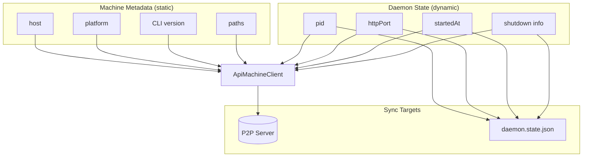

- **Метаданные машины** — статическая информация (host, платформа, версия CLI, пути).
- **Состояние демона** — динамическое (pid, httpPort, startedAt, информация об остановке).

Демон обновляет их через `ApiMachineClient` и зеркалирует локальное состояние в `daemon.state.json` для контроля/диагностики.

## RPC и мост инструментов

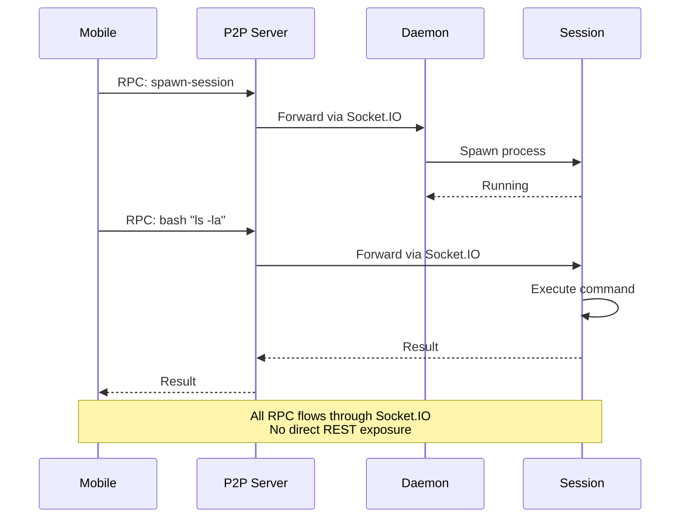

RPC используется для отправки команд по Socket.IO-соединению:
- Сессии регистрируют RPC-обработчики (например, `bash`, чтение/запись файлов, `ripgrep`, `difftastic`).
- Демон регистрирует обработчик `spawn-session`, чтобы сервер/мобильный клиент мог попросить его запустить локальную сессию.

Этот механизм позволяет P2P-серверу и мобильным клиентам управлять локальными действиями без широкой REST-поверхности.

## Сервисы демона

Опциональные сервисы, размещённые в демоне и доступные через P2P REST API:

| Сервис | Endpoints | Примечания |
|--------|-----------|------------|
| Whisper STT | `GET /v1/whisper/status`, `POST /v1/voice/transcribe` | Локальная транскрипция через whisper.cpp (`src/daemon/whisper/`) |
| TTS | `GET /v1/tts/status`, `POST /v1/voice/synthesize` | edge-tts (по умолчанию) или qwen3-tts; при `ttsEdgeVoice: 'auto'` (дефолт конфигурации) голос Edge подбирается по языку ответа (`src/daemon/tts/edgeTtsProvider.ts`) |
| Concierge | `GET /v1/concierge/status`, `POST /v1/concierge/chat` | Опциональный локальный LLM-ассистент («Jarvis») через LM Studio (`src/daemon/concierge/conciergeService.ts`). Персона + мягкие правила: `CONCIERGE_SYSTEM_PROMPT`; жёсткие ограничения в коде (whitelist из 3 инструментов, валидация агента/директории перед запуском, 4 раунда × 5 вызовов инструментов, один spawn на диалог). Пользовательский суффикс промпта: `conciergeExtraPrompt` в setup.json (не может переопределить базовые правила) |

### Локальный concierge (LM Studio)

Лёгкий LLM-ассистент, встроенный в демон. По умолчанию отключён; включается через `conciergeEnabled` в `~/.remcli/setup.json` (`conciergeUrl` по умолчанию `http://127.0.0.1:1234/v1`, пустой `conciergeModel` = первая модель, которую сообщает сервер). Работает с любым OpenAI-совместимым API и маршрутизирует намерение в детерминированные вызовы функций:

- `list_sessions` — список активных сессий
- `get_daemon_status` — версия/uptime/порт/туннель демона
- `spawn_agent_session` — запускает сессию агента, только по явному запросу пользователя

`POST /v1/concierge/chat` возвращает `{ reply, actions }`; доступность дёшево проверяется запросом к `{url}/models` (выключенный LM Studio возвращает 503 и никогда не роняет демон).

## Мастер настройки и диагностика

### `remcli setup`

Интерактивный мастер настройки (`src/commands/setup.ts`), который конфигурирует:
1. **Модель Whisper STT** — выбирает и скачивает локальную модель распознавания речи.
2. **TTS-провайдер** — edge-tts (бесплатно, без настройки) или qwen3-tts (локальное клонирование голоса, только Apple Silicon).
3. **Установку AI-агентов** — устанавливает поддерживаемых агентов кроссплатформенными командами.
4. **HTTPS-туннель cloudflared** — устанавливает бинарник cloudflared для удалённого доступа и голосового ввода в вебе.

Поддерживаемые агенты:

| Агент | Бинарник | macOS / Linux | Windows |
|-------|----------|---------------|---------|
| Claude Code | `claude` | `curl -fsSL https://claude.ai/install.sh \| bash` | `irm https://claude.ai/install.ps1 \| iex` |
| Gemini CLI | `gemini` | `npm install -g @google/gemini-cli` | `npm install -g @google/gemini-cli` |
| Codex CLI | `codex` | `npm install -g @openai/codex` | `npm install -g @openai/codex` |
| Cursor CLI | `agent` (старые сборки: `cursor-agent`) | `curl https://cursor.com/install -fsS \| bash` | `curl https://cursor.com/install -fsS \| bash` |

Установка cloudflared по платформам:

| Платформа | Команда |
|-----------|---------|
| macOS | `brew install cloudflared` |
| Linux | скачивание `.deb` из GitHub releases |
| Windows | `winget install Cloudflare.cloudflared` |

Authtoken не нужен — quick tunnels cloudflared работают из коробки.

Определение платформы — через `process.platform === 'win32'`. Установка выполняется со `stdio: 'inherit'`, чтобы пользователь видел прогресс в реальном времени.

Конфигурация сохраняется в `~/.remcli/setup.json`.

### `remcli doctor`

Команда диагностики (`src/ui/doctor.ts`), которая проверяет:
- Базовую информацию (версия, платформа, Node.js)
- Статус демона и процессы
- Статус модели Whisper STT
- Статус TTS-провайдера
- **Доступность AI-агентов** — обнаруживает все четыре агента (Claude Code, Gemini CLI, Codex CLI, Cursor CLI) через `which`/`where` и сообщает установленные версии (Cursor: `agent`, fallback `cursor-agent`)
- Файлы логов и ссылки на поддержку

## Ссылки на реализацию
- Точка входа CLI: `packages/remcli-cli/src/index.ts`
- Координатор демона: `packages/remcli-cli/src/daemon/run.ts`
- Модули демона: `packages/remcli-cli/src/daemon/sessionSpawner.ts`, `machineSocket.ts`, `heartbeat.ts`
- Контрольный сервер/клиент: `packages/remcli-cli/src/daemon/controlServer.ts`, `packages/remcli-cli/src/daemon/controlClient.ts`
- Concierge: `packages/remcli-cli/src/daemon/concierge/conciergeService.ts`
- TTS: `packages/remcli-cli/src/daemon/tts/`
- API-клиенты: `packages/remcli-cli/src/api`
- Персистентность: `packages/remcli-cli/src/persistence.ts`
- Конфигурация: `packages/remcli-cli/src/configuration.ts`
