# Encryption and Data Encoding

This document details how client data is encrypted, how encrypted blobs are structured, and how those blobs map onto protocol fields. It is based on `packages/remcli-cli/src/api/encryption.ts` and the server routes that accept/emit these values.

For transport and event shapes, see `protocol.md`.

## Overview

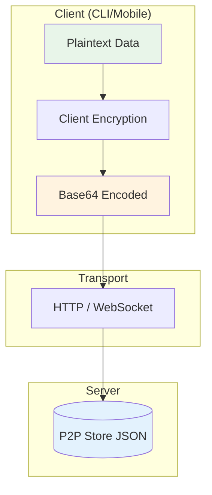

## Design goals
- Keep the server blind to user content (end-to-end encryption on clients).
- Use explicit, stable binary layouts so clients can interoperate across versions.
- Prefer simple, consistent base64 encoding on the wire.

## Encryption variants

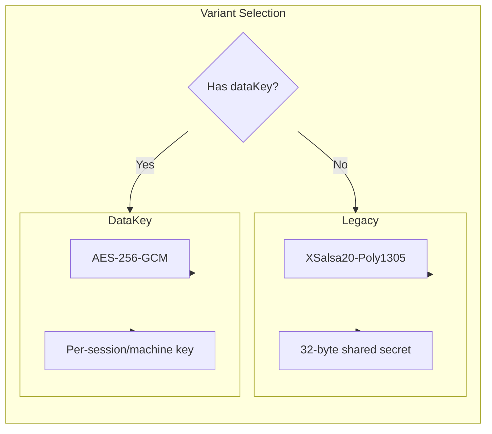

Clients currently use one of two encryption variants:

### 1) legacy (NaCl secretbox)
Used when the client only has a shared secret key.

**Algorithm**: `tweetnacl.secretbox` (XSalsa20-Poly1305)
- **Nonce length**: 24 bytes
- **Key length**: 32 bytes

**Binary layout** (plaintext JSON -> bytes):
```
[ nonce (24) | ciphertext+auth (secretbox output) ]
```

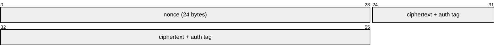

### 2) dataKey (AES-256-GCM)
Used when the client supports per-session/per-machine data keys.

**Algorithm**: AES-256-GCM
- **Nonce length**: 12 bytes
- **Auth tag**: 16 bytes
- **Key length**: 32 bytes

**Binary layout**:
```
[ version (1) | nonce (12) | ciphertext (...) | authTag (16) ]
```

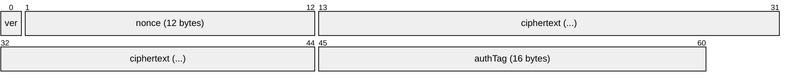

- `version` is currently `0`.

## Data encryption key (dataKey variant)

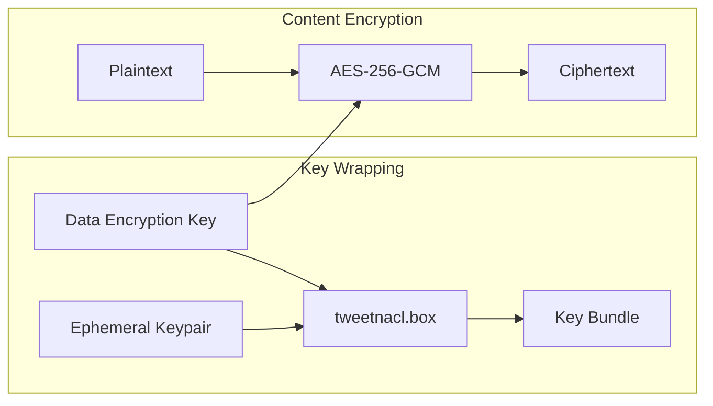

When `dataKey` is used, the actual content key is encrypted for storage/transport.

**Algorithm**: `tweetnacl.box` with an ephemeral keypair.
- **Ephemeral public key**: 32 bytes
- **Nonce**: 24 bytes

**Binary layout**:
```
[ ephPublicKey (32) | nonce (24) | ciphertext (...) ]
```

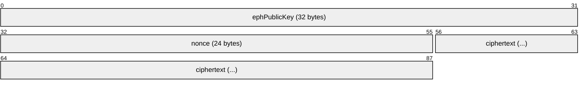

This blob is then wrapped with a version byte before being sent/stored:
```
[ version (1 = 0) | boxBundle (...) ]
```

The resulting bytes are base64-encoded and placed in fields such as `dataEncryptionKey` for sessions/machines/artifacts.

## Where encryption is applied

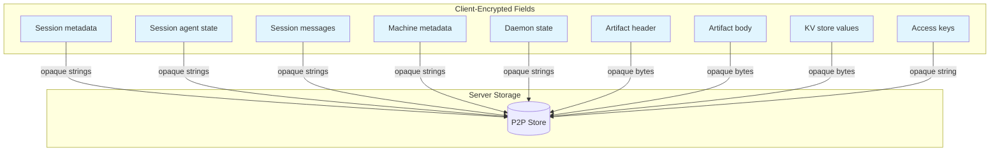

The P2P server treats these fields as opaque strings/blobs. The client encrypts them before sending.

### Session metadata + agent state
- **Encrypted by client** and stored in P2P Store.
- Used in:
  - `POST /v1/sessions` (create/load)
  - WebSocket `update-metadata` / `update-state`
  - `update-session` events

### Session messages

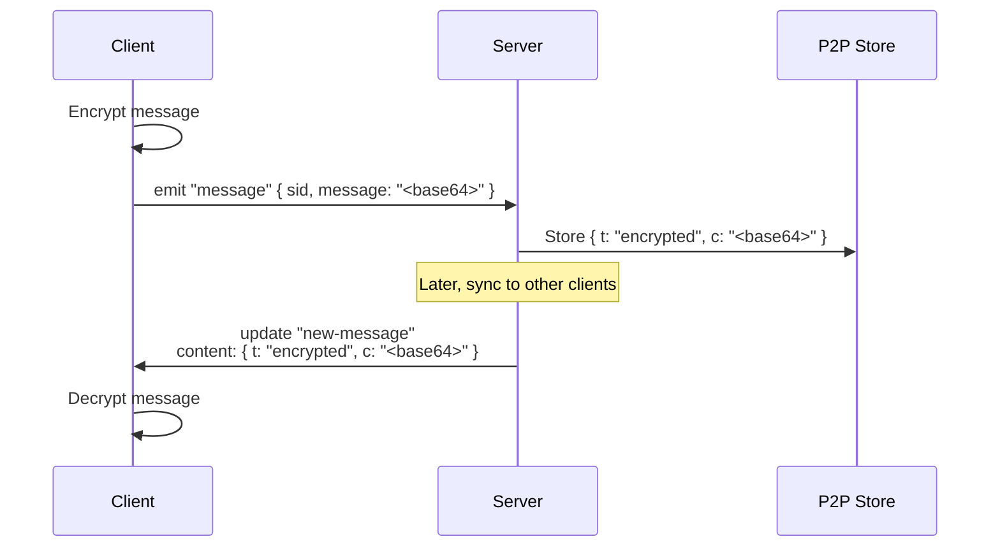

- Client emits `message` with a base64 encrypted blob.
- Server stores it as `SessionMessage.content`:
  - `{ t: "encrypted", c: "<base64>" }`
- Server emits it back in `new-message` updates with the same structure.

### Machine metadata + daemon state
- **Encrypted by client** and stored in P2P Store.
- Used in:
  - `POST /v1/machines`
  - WebSocket `machine-update-metadata` / `machine-update-state`
  - `update-machine` events

### Artifacts
- `header` and `body` are encrypted bytes encoded as base64 on the wire.
- Stored in P2P Store.
- Emitted in `new-artifact` / `update-artifact` events as base64 strings.

### Access keys
- `AccessKey.data` is treated as an **opaque encrypted string**.
- The server does not decode it or inspect its contents.

### Key-value store
- `UserKVStore.value` is encrypted bytes encoded as base64 on the wire.
- `kvMutate` expects base64 strings; `kvGet/list/bulk` return base64 strings.

## On-wire formats (encrypted fields)

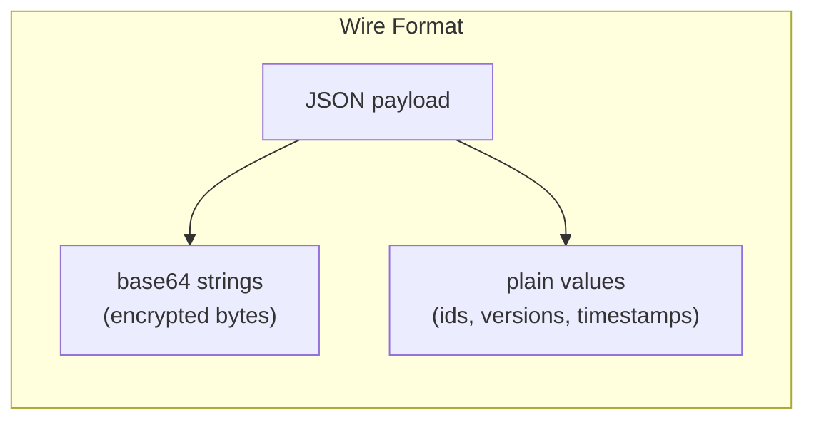

Below are the typical JSON shapes that carry encrypted data. All `...` values are base64 strings representing encrypted bytes.

### Session creation
```http
POST /v1/sessions
```
```json
{
  "tag": "<string>",
  "metadata": "<base64 encrypted>",
  "agentState": "<base64 encrypted or null>",
  "dataEncryptionKey": "<base64 data key bundle or null>"
}
```

### Encrypted message (client -> server)
```
Socket emit: "message"
```
```json
{
  "sid": "<session id>",
  "message": "<base64 encrypted>"
}
```

### Encrypted message (server -> client)
```
update.body.t = "new-message"
```
```json
{
  "t": "encrypted",
  "c": "<base64 encrypted>"
}
```

### Session metadata update (WebSocket)
```
Socket emit: "update-metadata"
```
```json
{
  "sid": "<session id>",
  "metadata": "<base64 encrypted>",
  "expectedVersion": 3
}
```

### Machine update (WebSocket)
```
Socket emit: "machine-update-state"
```
```json
{
  "machineId": "<machine id>",
  "daemonState": "<base64 encrypted>",
  "expectedVersion": 2
}
```

### Artifact create/update (HTTP)
```http
POST /v1/artifacts
```
```json
{
  "id": "<uuid>",
  "header": "<base64 encrypted>",
  "body": "<base64 encrypted>",
  "dataEncryptionKey": "<base64 data key bundle>"
}
```

### KV mutate (HTTP)
```http
POST /v1/kv
```
```json
{
  "mutations": [
    { "key": "prefs.theme", "value": "<base64 encrypted>", "version": 2 },
    { "key": "prefs.legacy", "value": null, "version": 5 }
  ]
}
```

## Client-side types (shapes used before encryption)
These are the client-side structures that get encrypted and sent over the wire. They are defined in `packages/remcli-cli/src/api/types.ts`.

### Session message content (encrypted)
The payload stored in `SessionMessage.content` is always encrypted and wrapped as:
```json
{ "t": "encrypted", "c": "<base64 encrypted>" }
```

### Encrypted message payload (plaintext before encryption)
Messages are encrypted as `MessageContent` and then base64 encoded:

**User message**
```json
{
  "role": "user",
  "content": { "type": "text", "text": "..." },
  "localKey": "...",
  "meta": { }
}
```

**Agent message**
```json
{
  "role": "agent",
  "content": { "type": "output | codex | acp | event", "data": "..." },
  "meta": { }
}
```

### Metadata (encrypted)
```json
{
  "path": "...",
  "host": "...",
  "homeDir": "...",
  "remcliHomeDir": "...",
  "remcliLibDir": "...",
  "remcliToolsDir": "...",
  "version": "...",
  "name": "...",
  "os": "...",
  "summary": { "text": "...", "updatedAt": 123 },
  "machineId": "...",
  "claudeSessionId": "...",
  "tools": ["..."],
  "slashCommands": ["..."],
  "startedFromDaemon": true,
  "hostPid": 12345,
  "startedBy": "daemon | terminal",
  "lifecycleState": "running | archiveRequested | archived",
  "lifecycleStateSince": 123,
  "archivedBy": "...",
  "archiveReason": "...",
  "flavor": "..."
}
```

### Agent state (encrypted)
```json
{
  "controlledByUser": true,
  "requests": {
    "<id>": { "tool": "...", "arguments": {}, "createdAt": 123 }
  },
  "completedRequests": {
    "<id>": {
      "tool": "...",
      "arguments": {},
      "createdAt": 123,
      "completedAt": 123,
      "status": "canceled | denied | approved",
      "reason": "...",
      "mode": "default | acceptEdits | bypassPermissions | plan | read-only | safe-yolo | yolo",
      "decision": "approved | approved_for_session | denied | abort",
      "allowTools": ["..."]
    }
  }
}
```

### Machine metadata (encrypted)
```json
{
  "host": "...",
  "platform": "...",
  "remcliCliVersion": "...",
  "homeDir": "...",
  "remcliHomeDir": "...",
  "remcliLibDir": "..."
}
```

### Daemon state (encrypted)
```json
{
  "status": "running | shutting-down",
  "pid": 123,
  "httpPort": 123,
  "startedAt": 123,
  "shutdownRequestedAt": 123,
  "shutdownSource": "mobile-app | cli | os-signal | unknown"
}
```

## Decryption flow (client side)

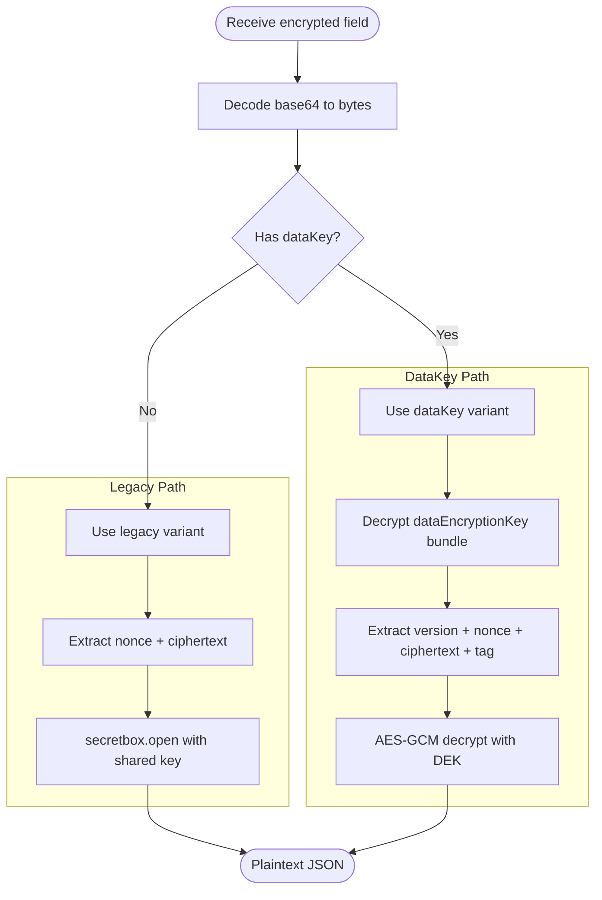

- Read base64 field from API/Socket.
- Decode base64 to bytes.
- Choose encryption variant (`legacy` or `dataKey`) based on local credentials.
- Decrypt bytes using the appropriate key and algorithm.

For `dataKey`, clients must first decrypt or derive the per-session/per-machine data key from the stored `dataEncryptionKey` bundle.

## Encoding conventions

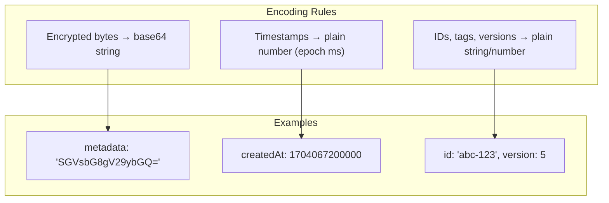

- All encrypted bytes are base64 strings on the wire unless explicitly noted.
- Timestamps remain plain numbers (epoch ms) and are not encrypted by the server.
- Non-encrypted identifiers (ids, tags, versions) are always plain strings/numbers.

## Implementation references
- Client crypto: `packages/remcli-cli/src/api/encryption.ts`
- Session message format: `packages/remcli-cli/src/api/types.ts`
- Server message ingestion: `packages/remcli-cli/src/daemon/p2p/p2pSocketHandlers.ts`
- Artifact/KV routes: `packages/remcli-cli/src/daemon/p2p/p2pRestRoutes.ts`
