# Шифрование и кодирование данных

Этот документ описывает, как шифруются клиентские данные, как устроены зашифрованные блобы и как эти блобы ложатся на поля протокола. Основан на `packages/remcli-cli/src/api/encryption.ts` и серверных роутах, которые принимают/отдают эти значения.

Транспорт и форматы событий — см. `protocol.md`.

## Обзор

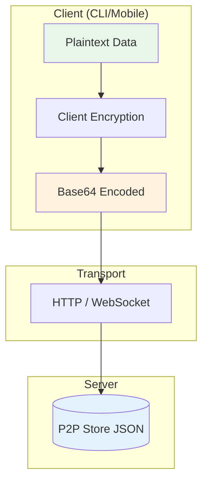
```mermaid
graph TB
    subgraph "Client (CLI/Mobile)"
        Plain[Plaintext Data]
        ClientEnc[Client Encryption]
        B64[Base64 Encoded]
    end

    subgraph "Transport"
        Wire[HTTP / WebSocket]
    end

    subgraph "Server"
        Store[(P2P Store JSON)]
    end

    Plain --> ClientEnc --> B64 --> Wire --> Store

    style Plain fill:#e8f5e9
    style B64 fill:#fff3e0
    style Store fill:#e3f2fd
```

## Цели дизайна
- Сервер не должен видеть пользовательский контент (сквозное шифрование на клиентах).
- Явные, стабильные бинарные форматы, чтобы клиенты разных версий были совместимы.
- Простое, единообразное кодирование base64 на проводе.

## Варианты шифрования

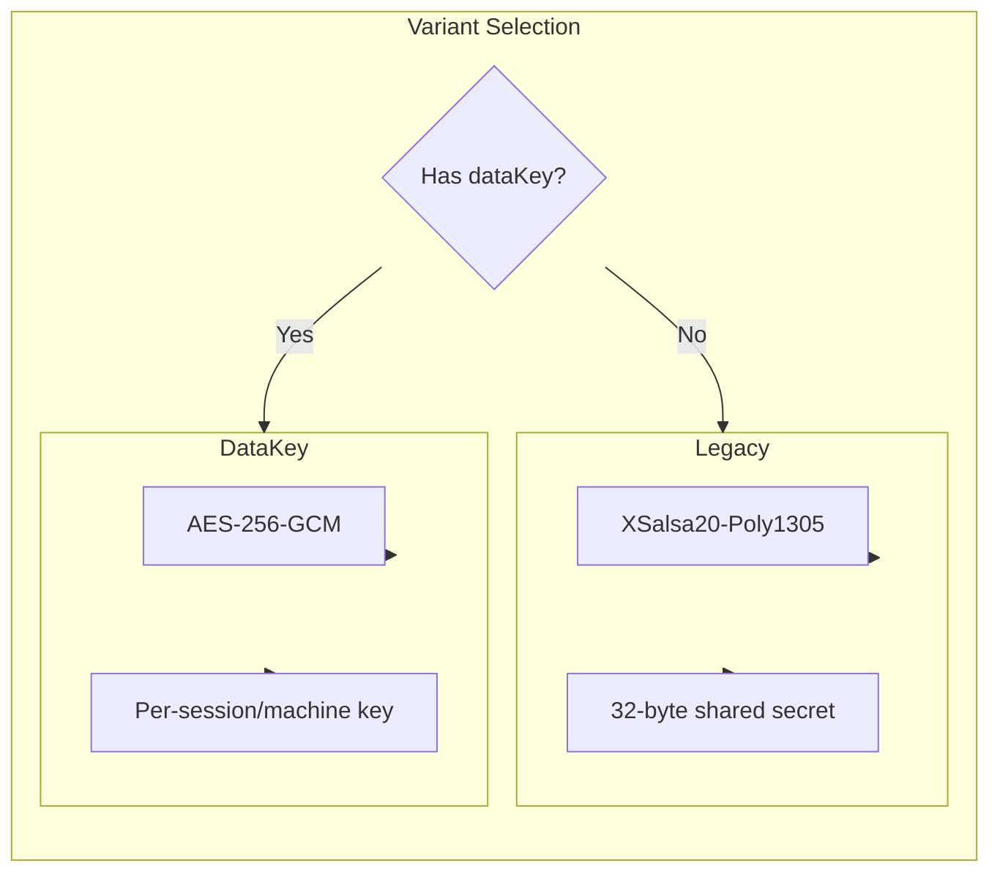
```mermaid
graph LR
    subgraph "Variant Selection"
        Check{Has dataKey?}
        Check --> |No| Legacy[Legacy NaCl]
        Check --> |Yes| DataKey[DataKey AES-GCM]
    end

    subgraph "Legacy"
        L1[XSalsa20-Poly1305]
        L2[32-byte shared secret]
    end

    subgraph "DataKey"
        D1[AES-256-GCM]
        D2[Per-session/machine key]
    end

    Legacy --> L1 & L2
    DataKey --> D1 & D2
```

Сейчас клиенты используют один из двух вариантов шифрования:

### 1) legacy (NaCl secretbox)
Используется, когда у клиента есть только общий секретный ключ.

**Алгоритм**: `tweetnacl.secretbox` (XSalsa20-Poly1305)
- **Длина nonce**: 24 байта
- **Длина ключа**: 32 байта

**Бинарный формат** (plaintext JSON -> байты):
```
[ nonce (24) | ciphertext+auth (secretbox output) ]
```

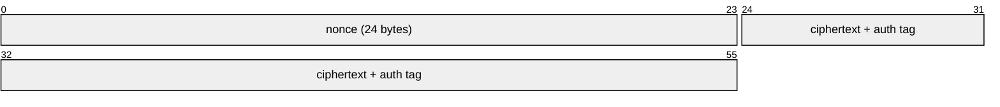
```mermaid
packet-beta
  0-23: "nonce (24 bytes)"
  24-55: "ciphertext + auth tag"
```

### 2) dataKey (AES-256-GCM)
Используется, когда клиент поддерживает ключи данных per-session/per-machine.

**Алгоритм**: AES-256-GCM
- **Длина nonce**: 12 байт
- **Auth tag**: 16 байт
- **Длина ключа**: 32 байта

**Бинарный формат**:
```
[ version (1) | nonce (12) | ciphertext (...) | authTag (16) ]
```

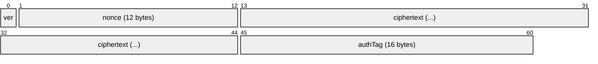
```mermaid
packet-beta
  0-0: "ver"
  1-12: "nonce (12 bytes)"
  13-44: "ciphertext (...)"
  45-60: "authTag (16 bytes)"
```

- `version` сейчас равен `0`.

## Ключ шифрования данных (вариант dataKey)

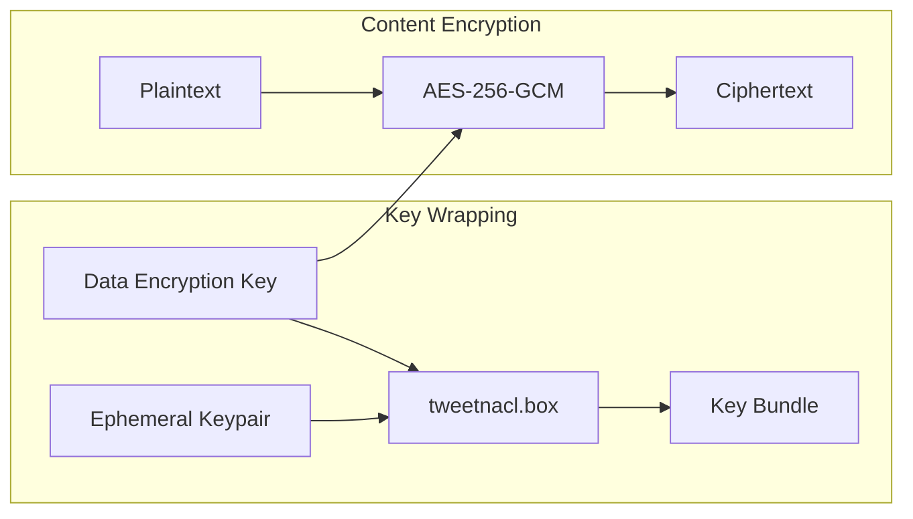
```mermaid
flowchart LR
    subgraph "Key Wrapping"
        DEK[Data Encryption Key]
        Eph[Ephemeral Keypair]
        Box[tweetnacl.box]
        Bundle[Key Bundle]
    end

    DEK --> Box
    Eph --> Box
    Box --> Bundle

    subgraph "Content Encryption"
        Plain[Plaintext]
        AES[AES-256-GCM]
        Cipher[Ciphertext]
    end

    DEK --> AES
    Plain --> AES --> Cipher
```

Когда используется `dataKey`, сам ключ контента шифруется для хранения/передачи.

**Алгоритм**: `tweetnacl.box` с эфемерной парой ключей.
- **Эфемерный публичный ключ**: 32 байта
- **Nonce**: 24 байта

**Бинарный формат**:
```
[ ephPublicKey (32) | nonce (24) | ciphertext (...) ]
```

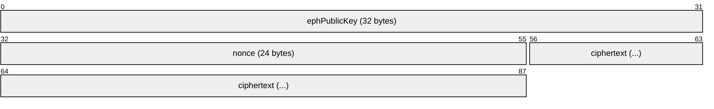
```mermaid
packet-beta
  0-31: "ephPublicKey (32 bytes)"
  32-55: "nonce (24 bytes)"
  56-87: "ciphertext (...)"
```

Затем этот блоб оборачивается байтом версии перед отправкой/сохранением:
```
[ version (1 = 0) | boxBundle (...) ]
```

Итоговые байты кодируются в base64 и помещаются в поля вроде `dataEncryptionKey` для сессий/машин.

## Где применяется шифрование

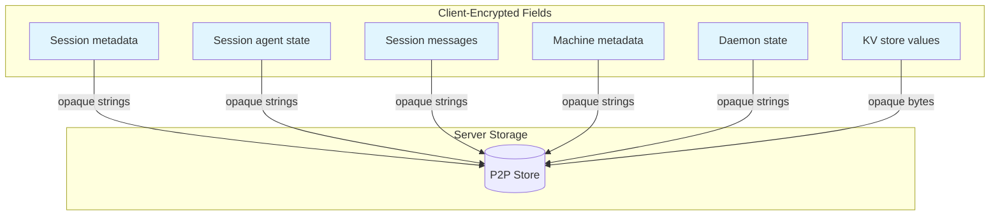
```mermaid
graph TB
    subgraph "Client-Encrypted Fields"
        direction TB
        S1[Session metadata]
        S2[Session agent state]
        S3[Session messages]
        M1[Machine metadata]
        M2[Daemon state]
        K1[KV store values]
    end

    subgraph "Server Storage"
        DB[(P2P Store)]
    end

    S1 & S2 & S3 --> |opaque strings| DB
    M1 & M2 --> |opaque strings| DB
    K1 --> |opaque bytes| DB

    style S1 fill:#e1f5fe
    style S2 fill:#e1f5fe
    style S3 fill:#e1f5fe
    style M1 fill:#e1f5fe
    style M2 fill:#e1f5fe
    style K1 fill:#e1f5fe
```

P2P-сервер трактует эти поля как непрозрачные строки/блобы. Клиент шифрует их перед отправкой.

### Метаданные сессии + состояние агента
- **Шифруются клиентом** и хранятся в P2P-хранилище.
- Используются в:
  - `POST /v1/sessions` (create/load)
  - WebSocket `update-metadata` / `update-state`
  - Событиях `update-session`

### Сообщения сессии

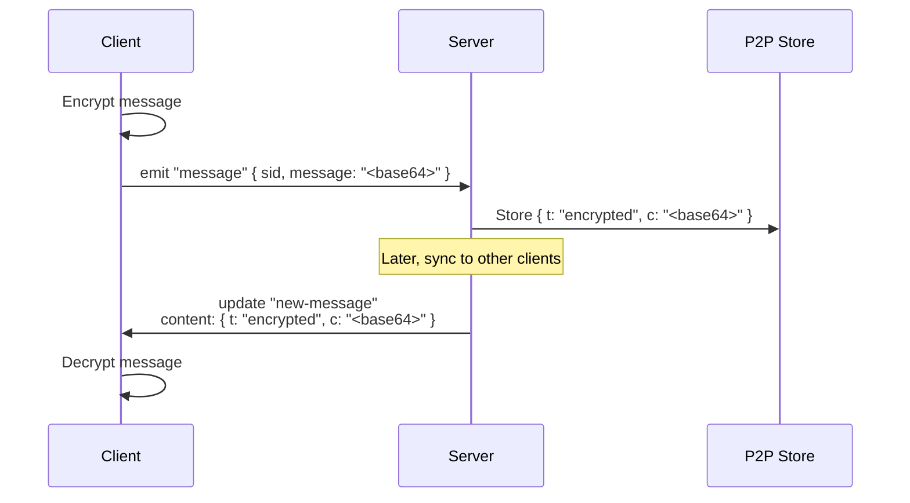
```mermaid
sequenceDiagram
    participant Client
    participant Server
    participant DB as P2P Store

    Client->>Client: Encrypt message
    Client->>Server: emit "message" { sid, message: "<base64>" }
    Server->>DB: Store { t: "encrypted", c: "<base64>" }

    Note over Server: Later, sync to other clients

    Server->>Client: update "new-message"<br/>content: { t: "encrypted", c: "<base64>" }
    Client->>Client: Decrypt message
```

- Клиент отправляет `message` с зашифрованным блобом в base64.
- Сервер сохраняет его как `SessionMessage.content`:
  - `{ t: "encrypted", c: "<base64>" }`
- Сервер отдаёт его обратно в обновлениях `new-message` в той же структуре.

### Метаданные машины + состояние демона
- **Шифруются клиентом** и хранятся в P2P-хранилище.
- Используются в:
  - `POST /v1/machines`
  - WebSocket `machine-update-metadata` / `machine-update-state`
  - Событиях `update-machine`

### Key-value хранилище
- `UserKVStore.value` — зашифрованные байты, закодированные в base64 на проводе.
- `kvMutate` ожидает base64-строки; `kvGet/list/bulk` возвращают base64-строки.

## Форматы на проводе (зашифрованные поля)

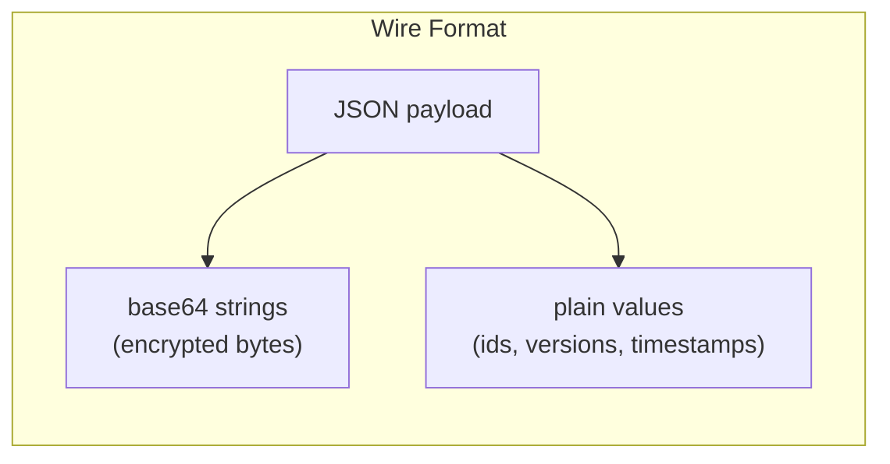
```mermaid
graph LR
    subgraph "Wire Format"
        JSON[JSON payload]
        B64["base64 strings<br/>(encrypted bytes)"]
        Plain["plain values<br/>(ids, versions, timestamps)"]
    end

    JSON --> B64
    JSON --> Plain
```

Ниже — типичные JSON-формы, несущие зашифрованные данные. Все значения `...` — base64-строки с зашифрованными байтами.

### Создание сессии
```http
POST /v1/sessions
```
```json
{
  "tag": "<string>",
  "metadata": "<base64 encrypted>",
  "agentState": "<base64 encrypted or null>",
  "dataEncryptionKey": "<base64 data key bundle or null>"
}
```

### Зашифрованное сообщение (клиент -> сервер)
```
Socket emit: "message"
```
```json
{
  "sid": "<session id>",
  "message": "<base64 encrypted>"
}
```

### Зашифрованное сообщение (сервер -> клиент)
```
update.body.t = "new-message"
```
```json
{
  "t": "encrypted",
  "c": "<base64 encrypted>"
}
```

### Обновление метаданных сессии (WebSocket)
```
Socket emit: "update-metadata"
```
```json
{
  "sid": "<session id>",
  "metadata": "<base64 encrypted>",
  "expectedVersion": 3
}
```

### Обновление машины (WebSocket)
```
Socket emit: "machine-update-state"
```
```json
{
  "machineId": "<machine id>",
  "daemonState": "<base64 encrypted>",
  "expectedVersion": 2
}
```

### Мутация KV (HTTP)
```http
POST /v1/kv
```
```json
{
  "mutations": [
    { "key": "prefs.theme", "value": "<base64 encrypted>", "version": 2 },
    { "key": "prefs.legacy", "value": null, "version": 5 }
  ]
}
```

## Клиентские типы (формы до шифрования)
Это клиентские структуры, которые шифруются и отправляются по проводу. Определены в `packages/remcli-cli/src/api/types.ts`.

### Содержимое сообщения сессии (зашифровано)
Payload, хранящийся в `SessionMessage.content`, всегда зашифрован и обёрнут как:
```json
{ "t": "encrypted", "c": "<base64 encrypted>" }
```

### Зашифрованный payload сообщения (plaintext до шифрования)
Сообщения шифруются как `MessageContent`, затем кодируются в base64:

**Сообщение пользователя**
```json
{
  "role": "user",
  "content": { "type": "text", "text": "..." },
  "localKey": "...",
  "meta": { }
}
```

**Сообщение агента**
```json
{
  "role": "agent",
  "content": { "type": "output | codex | acp | event", "data": "..." },
  "meta": { }
}
```

### Метаданные (зашифрованы)
```json
{
  "path": "...",
  "host": "...",
  "homeDir": "...",
  "remcliHomeDir": "...",
  "remcliLibDir": "...",
  "remcliToolsDir": "...",
  "version": "...",
  "name": "...",
  "os": "...",
  "summary": { "text": "...", "updatedAt": 123 },
  "machineId": "...",
  "claudeSessionId": "...",
  "tools": ["..."],
  "slashCommands": ["..."],
  "startedFromDaemon": true,
  "hostPid": 12345,
  "startedBy": "daemon | terminal",
  "lifecycleState": "running | archiveRequested | archived",
  "lifecycleStateSince": 123,
  "archivedBy": "...",
  "archiveReason": "...",
  "flavor": "..."
}
```

### Состояние агента (зашифровано)
```json
{
  "controlledByUser": true,
  "requests": {
    "<id>": { "tool": "...", "arguments": {}, "createdAt": 123 }
  },
  "completedRequests": {
    "<id>": {
      "tool": "...",
      "arguments": {},
      "createdAt": 123,
      "completedAt": 123,
      "status": "canceled | denied | approved",
      "reason": "...",
      "mode": "manual | default | acceptEdits | bypassPermissions | plan | auto | dontAsk | read-only | workspace-write | danger-full-access | auto_edit | yolo | agent | ask | force | auto-review",
      "decision": "approved | approved_for_session | denied | abort",
      "allowTools": ["..."]
    }
  }
}
```

### Метаданные машины (зашифрованы)
```json
{
  "host": "...",
  "platform": "...",
  "remcliCliVersion": "...",
  "homeDir": "...",
  "remcliHomeDir": "...",
  "remcliLibDir": "..."
}
```

### Состояние демона (зашифровано)
```json
{
  "status": "running | shutting-down",
  "pid": 123,
  "httpPort": 123,
  "startedAt": 123,
  "shutdownRequestedAt": 123,
  "shutdownSource": "remcli-web | remcli-cli | os-signal | unknown"
}
```

## Поток расшифровки (сторона клиента)

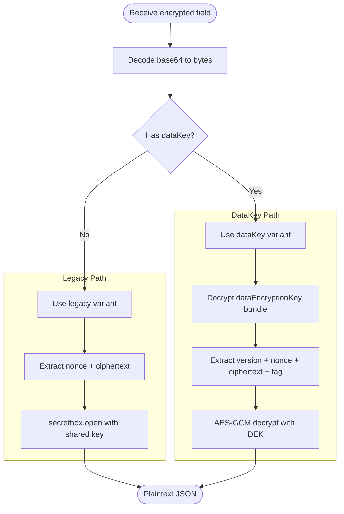
```mermaid
flowchart TD
    Start([Receive encrypted field]) --> B64[Decode base64 to bytes]
    B64 --> Check{Has dataKey?}

    Check --> |No| Legacy[Use legacy variant]
    Check --> |Yes| DataKey[Use dataKey variant]

    subgraph "Legacy Path"
        Legacy --> ExtractL[Extract nonce + ciphertext]
        ExtractL --> DecryptL[secretbox.open with shared key]
    end

    subgraph "DataKey Path"
        DataKey --> GetDEK[Decrypt dataEncryptionKey bundle]
        GetDEK --> ExtractD[Extract version + nonce + ciphertext + tag]
        ExtractD --> DecryptD[AES-GCM decrypt with DEK]
    end

    DecryptL --> Plain([Plaintext JSON])
    DecryptD --> Plain
```

- Прочитать base64-поле из API/Socket.
- Декодировать base64 в байты.
- Выбрать вариант шифрования (`legacy` или `dataKey`) по локальным учётным данным.
- Расшифровать байты соответствующим ключом и алгоритмом.

Для `dataKey` клиенты сначала должны расшифровать или вывести ключ данных per-session/per-machine из сохранённого бандла `dataEncryptionKey`.

## Соглашения по кодированию

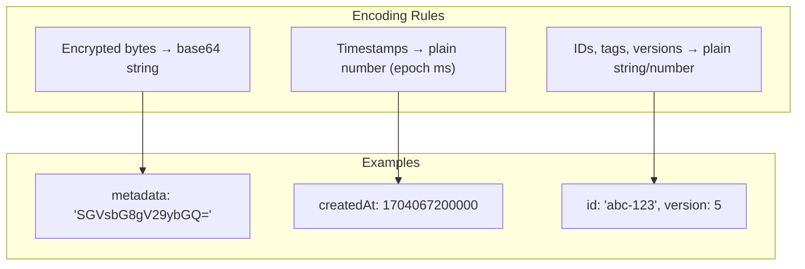
```mermaid
graph TB
    subgraph "Encoding Rules"
        E1["Encrypted bytes → base64 string"]
        E2["Timestamps → plain number (epoch ms)"]
        E3["IDs, tags, versions → plain string/number"]
    end

    subgraph "Examples"
        Ex1["metadata: 'SGVsbG8gV29ybGQ='"]
        Ex2["createdAt: 1704067200000"]
        Ex3["id: 'abc-123', version: 5"]
    end

    E1 --> Ex1
    E2 --> Ex2
    E3 --> Ex3
```

- Все зашифрованные байты на проводе — base64-строки, если явно не указано иное.
- Временные метки остаются обычными числами (epoch ms) и сервером не шифруются.
- Незашифрованные идентификаторы (ids, tags, versions) — всегда обычные строки/числа.

## Ссылки на реализацию
- Клиентская криптография: `packages/remcli-cli/src/api/encryption.ts`
- Формат сообщений сессии: `packages/remcli-cli/src/api/types.ts`
- Приём сообщений сервером: `packages/remcli-cli/src/daemon/p2p/p2pSocketHandlers.ts`
- KV-роуты: `packages/remcli-cli/src/daemon/p2p/p2pRestRoutes.ts`
